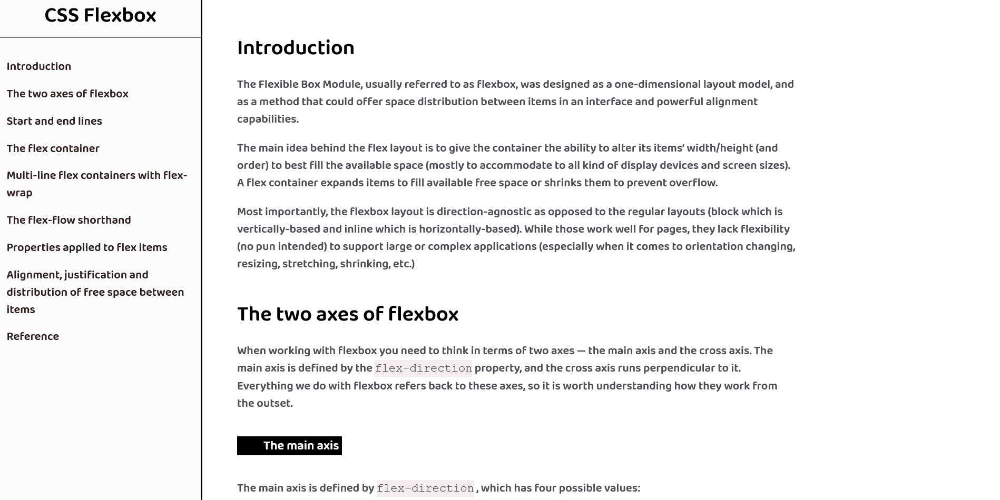

# FreeCodeCamp - Technical Documentation Page 

This is a solution to the [Build a Technical Documentation Page](https://www.freecodecamp.org/learn/responsive-web-design/responsive-web-design-projects/build-a-technical-documentation-page).  

## Table of contents

- [Overview](#overview)
  - [The challenge](#the-challenge)
  - [Screenshot](#screenshot)
  - [Links](#links)
- [My process](#my-process)
  - [Built with](#built-with)
  - [What I learned](#what-i-learned)
- [Author](#author)

## Overview

### The challenge

The challenge is to fulfill the user-stories given in the challenge and build a technical documentation page.   

### Screenshot



### Links

- Solution URL: [Solution](https://github.com/junaidshaikh-js/technical-documentation-page)
- Live Site URL: [Live Site](https://junaidshaikh-js.github.io/technical-documentation-page/)

## My process

### Built with

- Semantic HTML5 markup
- CSS custom properties
- Media queries used to make responsive webpage

### What I learned

What's new for me in this challenge is the use of CSS variables. They provide a easy way to set primary and secondary colors (not only limited to this) for the website and whole color where we applied the variable will be changed by changing only one value. 
Here is a CSS code that shows the variable used in this challenge. 

``` css
 :root {
    --code-color: rgb(245, 237, 237);
    --h3-back-color: black;
    --h3-text-color: white;
    --text-color: #4d4e53;
  }
```


## Author

- Linkedin Profile - [Junaid Shaikh](https://www.linkedin.com/in/junaidshaikhjs/)
